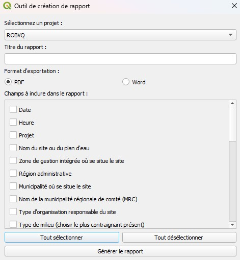

# Rapports Géofluence

Cette extension QGIS permet de générer des rapports aux formats word et pdf depuis les formulaires de Géofluence.

La mise en page des rapports est normalisée, permettant une génération rapide et efficace et rapports simples. Il est possible de personnaliser la mise en page de certains rapport au besoin.

## Fonctionnement

Vous devez d'abord sélectionner un rapport à remplir depuis le menu des extensions. Chaque rapport est associé à un formulaire spécifique. Pour produire un rapport, le formulaire doit évidemment être dans le projet actif.

On vous demande d'abord de sélectionner un projet. La liste des projets provient de la couche Événement, qui doit aussi se trouver dans le projet actif pour assurer le fonctionnement du plugin. La sélection d'un projet filtre les entités qui seront incluses dans le rapport.

Vous pouvez ensuite définir un titre de rapport. Pour les exportations PDF, ce titre sera celui qui apparaitra dans le rapport. Les exportations au format Word permettent de modifier le titre.

Le choix du format d'exportation se fait au moyen d'un bouton radio. Un seul format peut être sélectionné à la fois. 

Finalement, vous pouvez sélectionner manuellement les champs que vous souhaitez voir apparaitre dans le rapport. Vous pouvez sélectionner l'ensemble des champs du formulaire en cliquant sur "Tout sélectionner", dans le bas de la fenêtre. À noter que si un champ contient une valeur nulle ou vide pour une entité, celui-ci ne sera pas inclus dans le rapport. 

## Note pour les rapports Word

La génération des rapports Word s'effectue au moyen de plusieurs package qui ne sont pas compris par défaut dans l'environnement de QGIS. Pour pouvoir l'utiliser, il faut assurer l'installation des package et des dépendances.

Pour ce faire, copier le contenu du dossier "package-word" dans le dossier site-packages de QGIS, sur votre poste de travail : "C:\Program Files\QGIS 3.40.11\apps\Python312\Lib\site-packages".

Ce répertoire permet l'installation de packages tiers dans QGIS. Redémarrer le logiciel et vous serez en mesure d'exporter des rapports Word.

## Pour les photos

Pour que les photos prises à partir des formulaires apparaissent dans les rapports, vous devez créer un dossier DCIM, au même endroit que le projet QGIS utilisé pour générer les rapports. Placer les fichiers photo dans ce dossier en vous assurant que les noms des fichiers correspondent effectivement à ceux qu'on retrouve dans le formulaire. Si vous n'avez pas modifié le nom des fichiers après la collecte des données, les noms devraient correspondre sans problème.